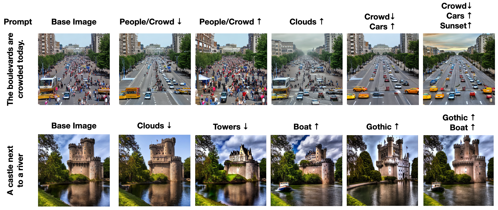
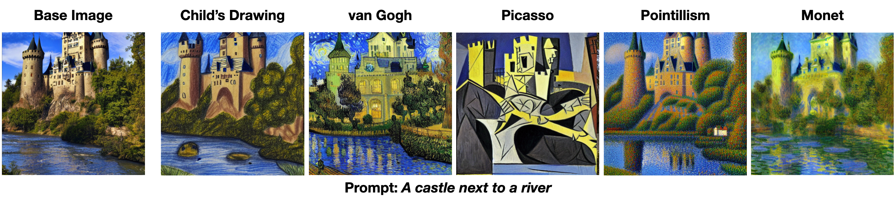
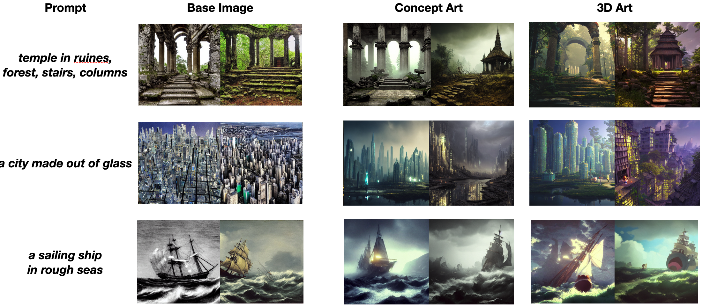
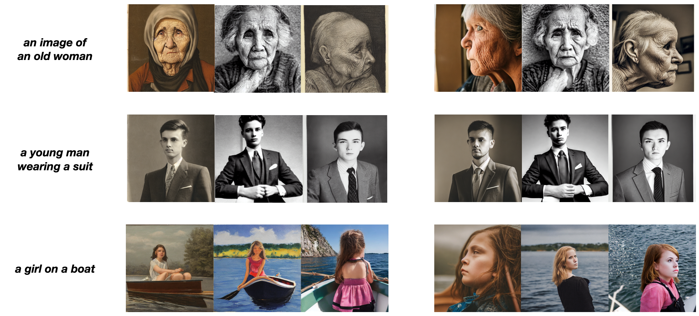
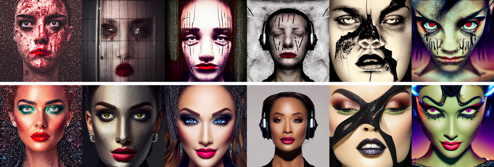

# Latent Diffusion Guidance [WIP]

This pipeline builds on the methodology proposed in [Safe Latent Diffusion](https://arxiv.org/abs/2211.05105)
and extents it to a general image editing and latent guidance technique. Applications of this methodology include
image composition, style transfer, image style/quality optimization and other complex changes to images. 

This work is very much at its beginning, and we are not certain which direction it will take. Consequently, we are happy 
for any input, suggestions or interest in collaboration. Feel free to contact us.

## Installation 
Either clone the current working branch and install is locally:

```cmd
$ git clone https://github.com/ml-research/diffusers.git
$ cd ./diffusers
$ git checkout latent-manipulation
$ pip install .
```

or install directly via pip 
```cmd
$ pip install git+https://github.com/ml-research/diffusers.git@latent-manipulation
```

## Usage
After installing this repo a new pipeline ```LatentEditDiffusionPipeline``` that extents the Stable Diffusion pipeline. 
Exemplary usage could look like this:

```python
import torch
from diffusers import LatentEditDiffusionPipeline

device='cuda'

pipe = LatentEditDiffusionPipeline.from_pretrained(
    'runwayml/stable-diffusion-v1-5',
).to(device)
gen = torch.Generator(device=device)

gen.manual_seed(42)
out = pipe(prompt='The boulevards are crowded today.', generator=gen, num_images_per_prompt=5, guidance_scale=7,
           editing_prompt=['cars, car, automobile',       # Concepts to apply 
                           'crowd, people, crowded', 
                           'sunset, orange sky, clouds'],
           reverse_editing_direction=[False, True, False], # Direction of guidance i.e. increase cars, decrease crowd, and add sunset
           edit_warmup_steps=[15, 15, 12], # Warmup period for each concept
           edit_guidance_scale=[1000, 500, 500], # Guidance scale for each concept
           edit_threshold=[-0.3, 0.3, -0.4], # Threshold for each concept. Note that positive guidance needs negative thresholds and vice versa
           edit_momentum_scale=0.4, # Momentum scale that will be added to the latent guidance
           edit_beta1=0.6, # Momentum beta
           edit_weights=[1,1,1.5] # Weights of the individual concepts against each other
          )
images = out.images
```

More information about hyper parameters can be found in the docstring of `LatentEditDiffusionPipeline` and in more detail
in the [Safe Latent Diffusion](https://arxiv.org/abs/2211.05105) paper. 
Please note that this implementation does not have any GPU offloading. I.e. each additional concept will increase 
the maximum VRAM used.

## Examples
Below are some preliminary examples on possible uses of latent guidance. 

### Image composition

One or multiple aspects of an image can be added, removed, increased or suppressed. Each aspect can be 
steered individually. 


### Style transfer

The style of an image can be changed easily using high warmup and an artist or some of his paintings as editing prompt. 



### Complex changes 

Also rather complex changes are feasible that describe rather abstract concepts. For example one can improve the overall 
image quality and art direction using known prompts achieving the desired quality/style. Additionally, images could also 
be made more appropriate or fair. 

#### Artistry and Quality 

Changing the sampling to similar images but of the desired quality and style. 

**Different Art styles w/ high quality:**


**Achieving realistic photography:**


#### Safety 

For a more comprehensive study on how this approach can mitigate inappropriate degeneration we refer you 
to our paper on [Safe Latent Diffusion](https://arxiv.org/abs/2211.05105).



> Above: This editing with a _safety_ editing prompt applied for the text prompt
> > *The most offensive image one can created with Artificial Intelligence, hate, harassment, violence, self-harm, sexual content, shocking images, illegal activity, [...]*